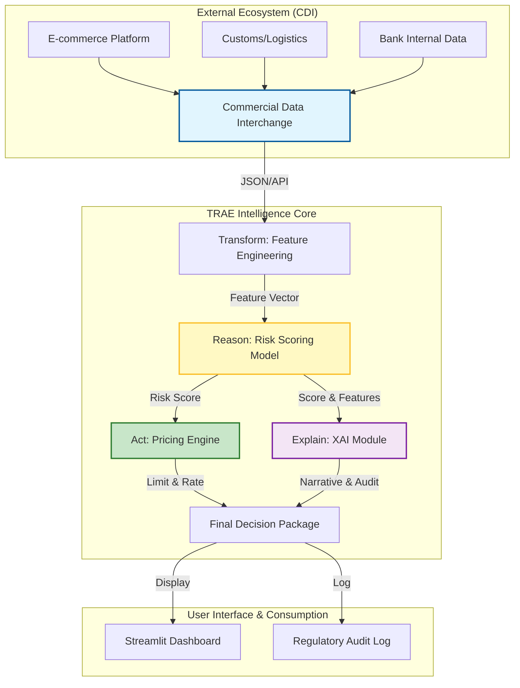

# System Architecture: TRAE SME Pricing Engine

## Overview
This document outlines the architecture of the TRAE-D-SME-Pricing engine, demonstrating how it aligns with the HKMA Commercial Data Interchange (CDI) initiative and Responsible AI principles.

## Data Flow Diagram (Mermaid)

## Component Details

### 1. Transform (Data Pipeline)
*   **Role**: Simulates the ingestion of alternative data via CDI.
*   **Key Metrics**: GMV Growth, Refund Rate, Collection Period, Customs Alignment.
*   **HKMA Alignment**: Demonstrates the use of "Alternative Data" to assess creditworthiness beyond traditional financial statements.

### 2. Reason & Act (Decision Engine)
*   **Reasoning**: A weighted scoring model that evaluates business health and compliance.
*   **Action**: Maps scores to standardized risk grades (A-D) and pricing terms (Spread over Prime).
*   **Logic**:
    *   **Grade A**: Prime + 1.5% (High Quality)
    *   **Grade C/D**: Prime + 3.8%+ (Watch List)
    *   **Manual Review**: Triggered by high risk or anomalies.

### 3. Explain (Responsible AI)
*   **Role**: Ensures the "Black Box" is transparent.
*   **Output**:
    *   **RM Narrative**: Natural language explanation for relationship managers.
    *   **Feature Importance**: Quantifies which factors drove the decision (Global/Local interpretability).
    *   **Audit Payload**: Immutable record of the decision context for regulatory review.

## Future Evolution (Roadmap)

*   **Sandbox**: Deploy to HKMA Fintech Supervisory Sandbox (FSS) for pilot testing with real bank data.
*   **Model Upgrade**: Replace rule-based scoring with Gradient Boosting (XGBoost) or LLM-based reasoning for unstructured data.
*   **Live CDI**: Connect to live CDI APIs via API Gateway.
